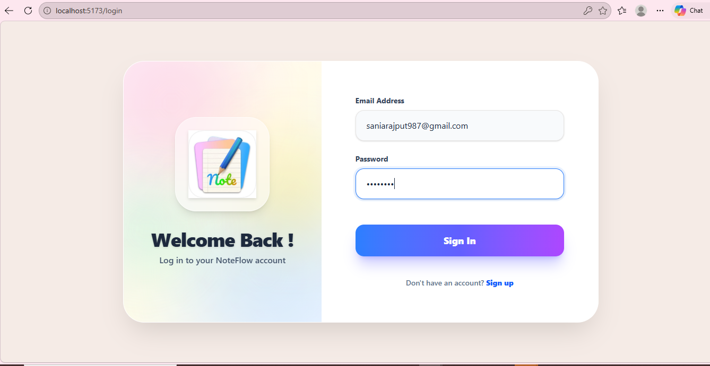
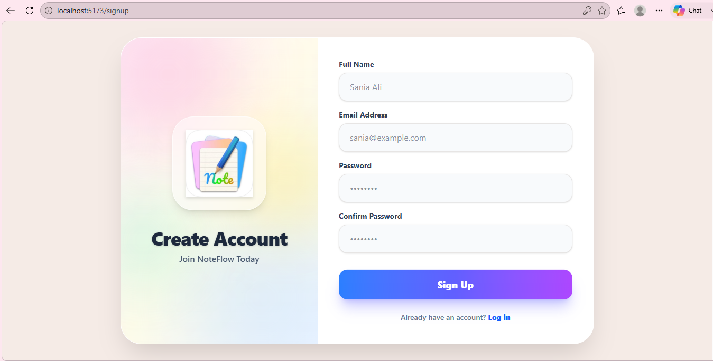
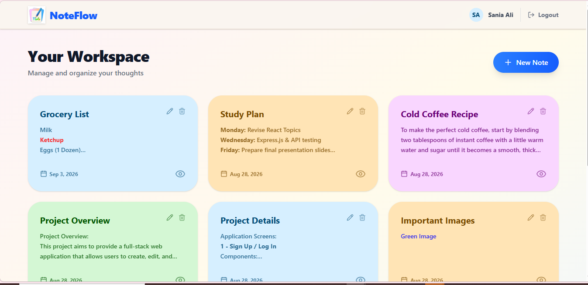
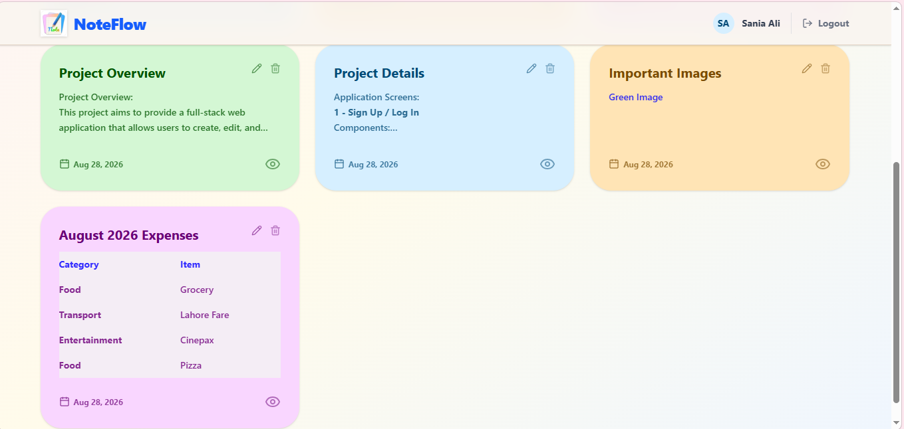
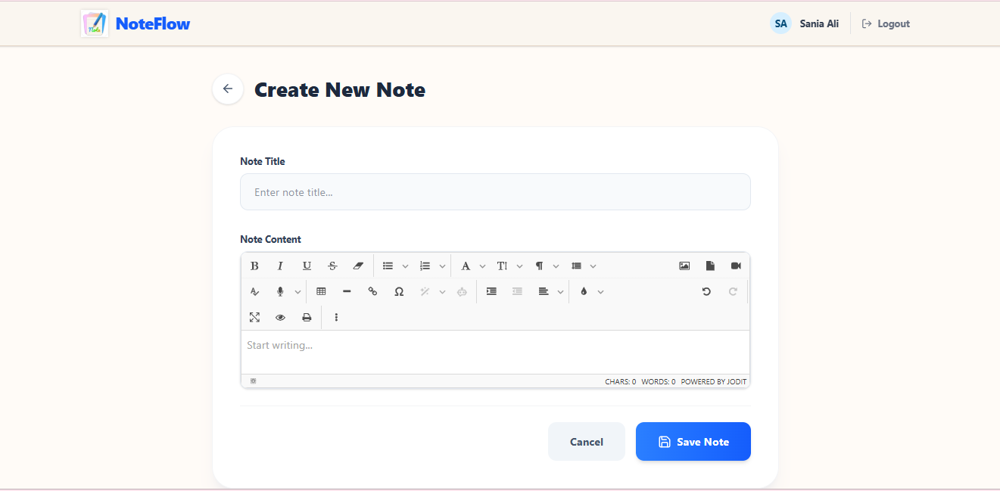
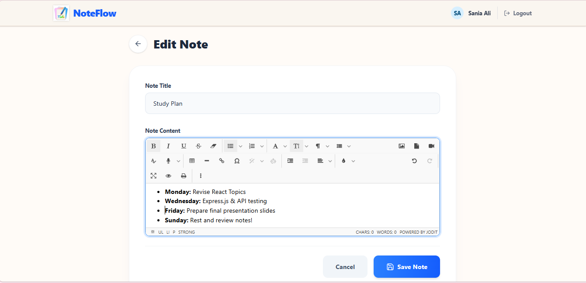
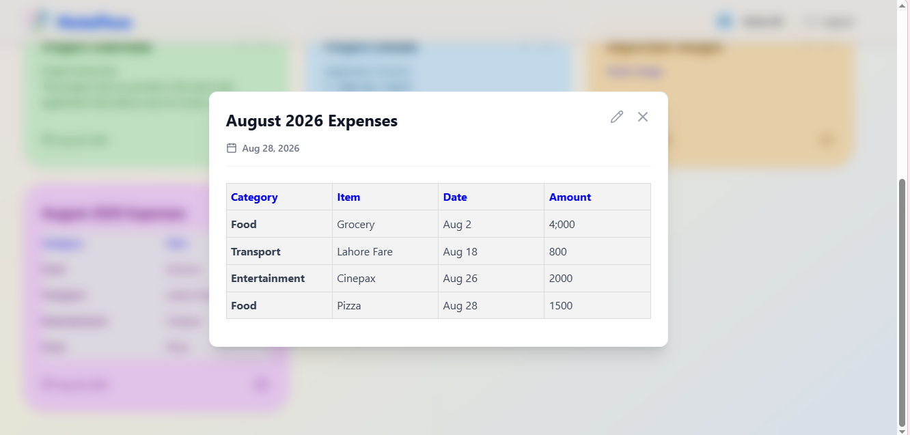

# cohort-9-mern-8174-sania
Cohort 9 — MERN (NodeJS+ReactJS) assignment for Sania Ali

# NoteFlow - Full Stack MERN Application

## Project Overview
A robust, full-stack web application for comprehensive notes management. This application provides seamless CRUD (Create, Read, Update, Delete) operations for notes. It is built with a strong focus on code quality, automated testing, and professional Git versioning.

## Technology Stack
* **Frontend:** React, Vite, Tailwind CSS, Jodit Editor
* **Backend:** Node.js, Express.js
* **Database:** MongoDB
* **Testing:** Mocha (Unit Testing)
* **Code Quality:** SonarQube Integration

## Key Features
* **Notes Management:** Complete CRUD operations for seamless notes creation and management.
* **Advanced Rich Text Editor (Powered by Jodit):** Integrated a fully featured Jodit Editor for notes formatting, supporting:
  * Text styling (Bold, Italic, Underline)
  * Lists (Bulleted and Numbered)
  * Media integration (Images and Videos)
  * Customization (Text color and Background color)
  * Data organization (Tables)
* **Application Logging:** Comprehensive event tracking and logging for important events, strictly avoiding the logging of credentials.
* **Error Handling:** Custom middlewares integrated to gracefully handle HTTP exceptions and provide meaningful error messages to users.

## Branching Strategy & Workflow
This repository strictly follows a feature-based Git workflow designed to support continuous development and integration.

### Core Branches
* `main`: The stable base branch for production-ready code.
* `develop`: The active development and integration branch.
* `feature/*`: Dedicated branches created for specific frontend and backend features.
* `bugfix/*`: Dedicated branches for resolving bugs and issues.

### Development Process
* **Stacked Branches:** New feature branches are created from the previous feature branch so development continues without interruption while earlier Pull Requests are under review.
* **Targeting PRs:** All Pull Requests are targeted strictly to the official `develop` branch.
* **Code Reviews:** Pull Requests first undergo an automated code review using CodeRabbit, and all bot comments are resolved prior to the mentor's code review.
* **Rebasing:** Once a Pull Request is merged into the official `develop` branch, the current working feature branch is rebased onto the latest upstream `develop` to preserve a clean commit history.
* **Clean Commits:** Pull Requests are kept focused on a single logical feature, and environment files or modules are strictly excluded using `.gitignore`.

## Application Screenshots

### Authentication
**Login & Sign Up**

### User Workspace
**Main Dashboard Views**

### Note Management & Rich Text Editor
**Creating & Editing Notes (Jodit Editor)**

**Table View in Notes**
